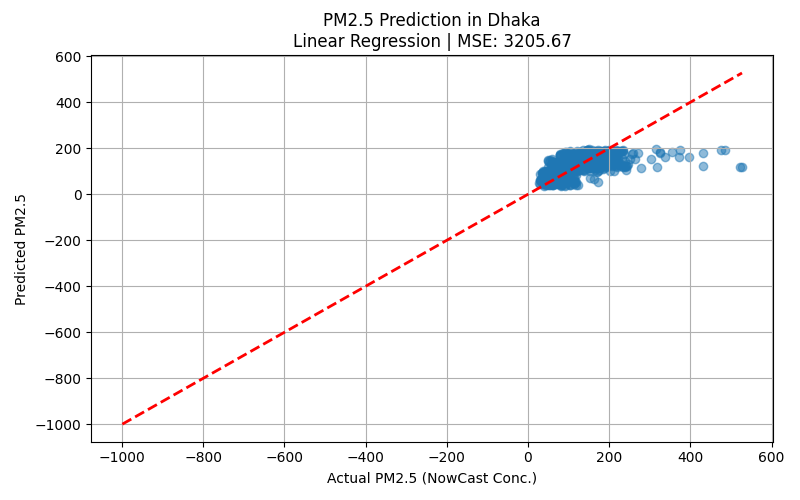

# 🔬 PM2.5 Prediction in Dhaka Using Linear Regression

I'm using a basic machine learning model to predict **PM2.5 concentration** (fine particulate matter) in Dhaka, Bangladesh based on temporal features like **hour of the day**, **day of the week**, and **month**. This project demonstrates how time patterns influence pollution levels, especially in urban environments.

---

## 📁 Folder Structure

```
AirPollutionDhaka/
├── Airpollution2022.csv         # Input dataset (hourly AQI readings for Dhaka, 2022)
├── pm25_regression.py           # Python script for modeling and visualization
├── prediction_plot.png          # Output: scatter plot of actual vs predicted PM2.5
└── README.md                    # Project documentation
```

---

## Project Summary

- 📅 Data: Hourly PM2.5 measurements for Dhaka (2022)
- 📈 Goal: Predict PM2.5 levels from time-based features
- 🤖 Model: Linear Regression (using `scikit-learn`)
- 📊 Output: A scatter plot comparing actual vs predicted values
- ⚠️ Performance: MSE ≈ 3205.67 (room for improvement with more features)

---

## The way it works

### Features Used:
- `Hour`: Hour of day (0–23)
- `DayOfWeek`: Day of the week (0=Monday, 6=Sunday)
- `Month`: Month of the year (1–12)

### Target Variable:
- `NowCast Conc.`: PM2.5 concentration in µg/m³

### Steps:
1. Load and clean the dataset
2. Extract datetime-based features
3. Train-test split
4. Train linear regression model
5. Evaluate using Mean Squared Error (MSE)
6. Visualize prediction results

---

## 📊 Results

The following plot shows how well the model predicted PM2.5 concentrations:



---

## ▶️ How to Run

1. Make sure files are organized like this:
   ```
   ~/Desktop/AirPollutionDhaka/Airpollution2022.csv
   ```

2. Run the script:
   ```bash
   python pm25_regression.py
   ```

3. The plot will be saved as `prediction_plot.png`.

---

## 🛠️ Requirements

- Python 3.x
- pandas
- matplotlib
- scikit-learn


